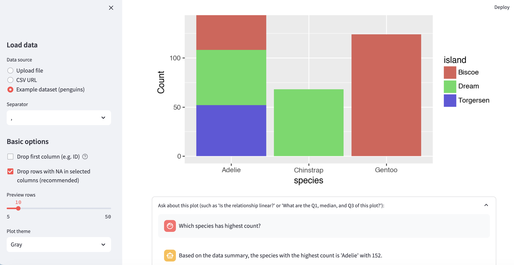

# 🎨 Stat Sketch: No-code Data Visualizer

**Live App:** [https://stat-sketch.streamlit.app/](https://stat-sketch.streamlit.app/)

**Stat Sketch** is an interactive web application designed for rapid data visualization and automated statistical analysis. By combining intuitive plotting tools with Large Language Models (LLMs), Stat Sketch helps you move from "looking at data" to "understanding data" in seconds.

---

## 🚀 Key Features

* **Instant Visualization**: Upload your CSV or Excel files and instantly generate professional histograms, box plots, scatter plots, and more.
* **Dynamic Customization**: Adjust plot parameters on the fly, such as bin widths, axis scaling, and categorical grouping.
* **AI Data Partner**: A built-in chat interface powered by high-speed inference (Groq) that acts as your personal data scientist.
* **Automated Context**: The AI doesn't just guess—it analyzes your data's statistical summary and current plot settings to give you accurate answers.

---

## 🤖 AI Chat: Ask Your Data Anything

The integrated AI assistant is designed to handle specific statistical queries. Because it has access to your data's distribution (Mean, Median, IQR, etc.), you can ask deep questions about the visual you are seeing.

### Example Queries:

**For Scatter Plots:**

* *"Is the relationship linear?"*
* *"Are there any outliers in the data?"*
* *"Is the relationship positive or negative?"*

**For Bar Plots:**

* *"Which category/species has the highest bar?"*
* *"What is the percentage difference between the two tallest bars?"*

**For Box Plots:**

* *"What is the Q1, Median, and Q3 of this plot?"*
* *"How spread out is the data compared to the other groups?"*

**General Insights:**

* *"Please explain this plot in simple terms."*
* *"What is the most interesting trend you see here?"*

---

## 🛡️ Data Privacy 

* Uploaded data is processed in-memory for the duration of your session and is not used to train the underlying AI models.